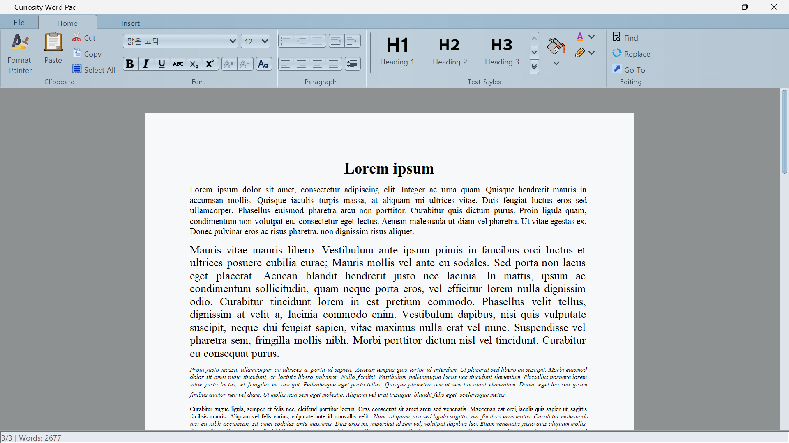
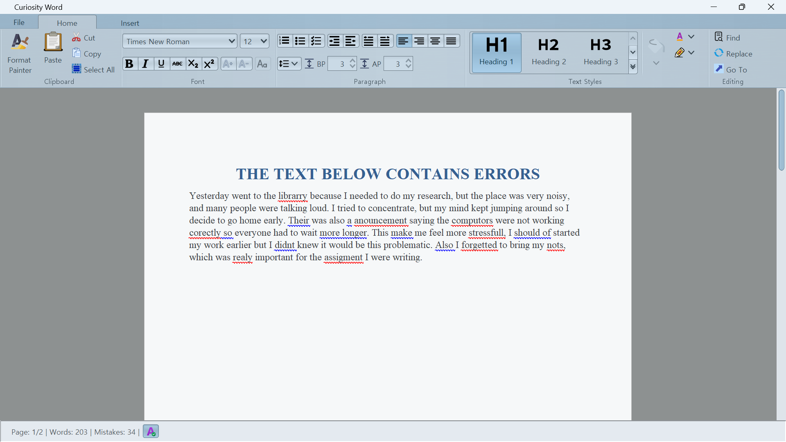

# Java Office - Word Processor



A feature-rich word processing application built with Java Swing and the Radiance UI framework. This modern text editor provides a Microsoft Word-like experience with advanced formatting capabilities, spell checking, and document management features.


## Features

### 📝 Core Editing
- Multi-page document support with A4 page layout
- Rich text formatting (bold, italic, underline, strikethrough)
- Subscript and superscript text
- Text alignment (left, center, right, justify)
- Multiple line spacing options (single, 1.5x, double)
- Paragraph indentation controls
- Format painter for copying text styles

### 🎨 Formatting & Styling
- Font family and size selection
- Text color and highlighting
- Background shading
- Text styles (H1-H6, normal, quote, paragraph)
- Change text case functionality
- Increase/decrease font size

### 📋 Advanced Features

- **Spell Checking**: Integrated spell checker with real-time suggestions using LanguageTool.
- **Lists**: Bulleted, numbered, and checkbox lists
- **Document Import/Export**: Support for DOCX format via Apache POI
- **Print Support**: Print documents with preview
- **Page Management**: Add and navigate between pages

### 🌍 Internationalization
Built-in support for multiple languages:
- English (en-US)
- Spanish (es-ES)
- Korean (ko-KR)
- Arabic (ar-AR)
- Luganda (lg-UG)

### 🎨 UI Themes
Powered by Radiance Theming with multiple skins:
- Office Blue 2007
- Business Blue Steel
- Dust Coffee

## Technology Stack

- **Java**: 23
- **UI Framework**: Swing with [Radiance](https://github.com/kirill-grouchnikov/radiance) components
- **Document Processing**: [Apache POI](https://poi.apache.org/) 5.5.1
- **Spell Checking**: [LanguageTool](https://languagetool.org/) 6.6
- **Build Tool**: Maven
- **Logging**: SLF4J 2.0.7

## Requirements

- Java Development Kit (JDK) 23 or higher
- Maven 3.0 or higher

## Installation

1. **Clone the repository**
   ```bash
   git clone https://github.com/oudepote-legomenon/java-office.git
   cd java-office
   ```

2. **Build the project**
   ```bash
   mvn clean install
   ```

3. **Run the application**
   ```bash
   mvn exec:java -Dexec.mainClass="com.oudepotelegomenon.App"
   ```
   OR
   ```bash
      mvn exec:java --define exec.mainClass=com.oudepotelegomenon.App
   ```

## Usage

### Basic Operations

- **Create New Document**: File → New → Blank Document
- **Open Document**: File → Open → Browse
- **Save Document**: File → Save As → Word Document
- **Format Text**: Use the ribbon interface for formatting options
- **Spell Check**: Automatic spell checking with right-click suggestions
- **Insert Table**: Insert → Table → Specify rows and columns
- **Change Language**: Modify the locale in `App.java` to switch UI language

## Project Structure

```
Java-office/
├── java-word/                        # Main application module
│   ├── pom.xml                       # Maven configuration
│   ├── src/
│   │   ├── main/
│   │   │   ├── java/com/oudepotelegomenon/
│   │   │   │   ├── App.java                    # Main word processor application
│   │   │   │   ├── PagedEditorKit.java         # Custom editor kit for paged documents
│   │   │   │   ├── PagePainter.java            # Page rendering and painting logic
│   │   │   │   ├── WrapEditorKit.java          # Text wrapping implementation
│   │   │   │   ├── Experiments/                # Feature prototypes and testing
│   │   │   │   │   ├── README.md               # Experiments documentation
│   │   │   │   │   ├── SpellCheckDemo.java     # Spell/grammar checker prototype
│   │   │   │   │   └── TextEditorWithTables.java  # Table editing prototype
│   │   │   │   └── transcodedIcons/            # SVG icons converted to Java classes
│   │   │   │       ├── Accessories_text_editor.java
│   │   │   │       ├── bold.java
│   │   │   │       ├── copy.java
│   │   │   │       └── ... (100+ icon classes)
│   │   │   └── resources/
│   │   │       └── i18n/                       # Internationalization resource bundles
│   │   │           ├── MessagesBundle_en_US.properties
│   │   │           ├── MessagesBundle_es_ES.properties
│   │   │           ├── MessagesBundle_ko_KR.properties
│   │   │           ├── MessagesBundle_ar_AR.properties
│   │   │           └── MessagesBundle_lg_UG.properties
│   │   └── test/java/                          # Unit tests
│   └── target/                                 # Compiled classes and build artifacts
├── Docs/
│   └── Images/                                 # Documentation screenshots
│       ├── Mainwindow.png
│       └── Errorcheck.png
├── LICENSE                                     # GPL-3.0 License
└── README.md                                   # This file
```

## Key Components

### Main Application (App.java)
The primary word processor with:
- Ribbon-style toolbar interface
- Document management (new, open, save, print)
- Comprehensive text formatting tools
- Multi-page document handling
- Application menu with recent documents

## Configuration

### Changing UI Language

Edit `App.java` to set your preferred locale:

```java
public static Locale locale = Locale.forLanguageTag("en-US");
```

Available locales: `en-US`, `es-ES`, `ko-KR`, `ar-AR`, `lg-UG`

### Changing UI Theme

Modify the skin in `App.java`:

```java
RadianceThemingCortex.GlobalScope.setSkin(new OfficeBlue2007Skin());
```

## Dependencies

- **Radiance**: Modern Swing UI components with ribbon interface
- **Apache POI**: Reading and writing Microsoft Office formats
- **LanguageTool**: Grammar and spell checking engine
- **SLF4J**: Logging facade

## Contributing

Contributions are welcome! Please feel free to submit pull requests or open issues for bugs and feature requests.

1. Fork the repository
2. Create your feature branch (`git checkout -b feature/AmazingFeature`)
3. Commit your changes (`git commit -m 'Add some AmazingFeature'`)
4. Push to the branch (`git push origin feature/AmazingFeature`)
5. Open a Pull Request

## License

This project is licensed under the GNU General Public License v3.0 - see the LICENSE file for details.

## Acknowledgments

- [Radiance](https://github.com/kirill-grouchnikov/radiance) - Modern Swing UI toolkit
- [Apache POI](https://poi.apache.org/) - Java API for Microsoft Documents
- [LanguageTool](https://languagetool.org/) - Open source proofreading software
- SVG icons from various sources like [Icons8](https://icons8.com), [SVG Repo](https://svgrepo.com) among others 

## Roadmap

- [ ] Export to PDF format
- [ ] Image manipulation
- [ ] Custom shapes and drawing tools
- [ ] More document templates
- [ ] Table features 
- [ ] Track changes
- [ ] [Radiance](https://github.com/kirill-grouchnikov/radiance) Locale selector
- [ ] [Radiance](https://github.com/kirill-grouchnikov/radiance) Theme selector
- [ ] Among others, God willing

## Contact

For questions or support, please open an issue on GitHub.

---

Built with ❤️ using Java and Swing
